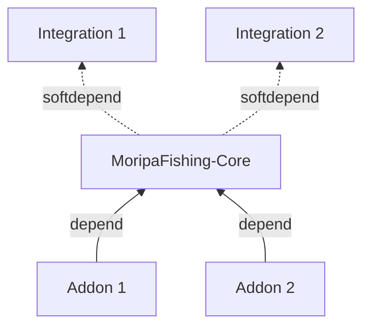

このプラグインは、Minecraftサーバーで魚釣りを楽しむためのプラグインです。
主な機能として、ランダムな魚の釣り上げを提供します。

釣り大会などのイベント機能は、Addonとして提供されることを想定しています。

以下に記載する対応範囲は本プラグインで実装されるべき機能です。
しかし、アドオン側として対応すべきとしている機能については、実装を行うということではありません。

対応範囲

### 当プラグインで対応すべき部分

#### 基本機能
- ワールドの管理
- 天候の決定と参照（ワールドへの実際の適用は Weather Integration が担当します）
- 魚釣りの基本システム
- 表示文言の国際化（`ja_JP` / `en_US` の翻訳ファイルによる切り替え）

#### 魚関連
- 魚のサイズなどの記録
- 魚の種類とレアリティの管理

#### システム関連
- 釣り上げまでの速度変化のインターフェース提供
- 釣果の統計データ収集（釣果ログはデータベースに永続化されます。既定は SQLite で、MySQL なども利用できます）

### アドオン側で対応すべき部分

#### イベント関連
- 特別な魚のイベント
- 釣り大会の開催

#### システム拡張
- 魚の売却
- スキルシステム
- 釣りスポットのランキング
- 釣りスポットの設定
- 釣り関連の実績
- 釣り竿のカスタマイズ
- 釣り竿の強化システム
- 釣り上げまでの時間調整
- 魚釣りクエスト

MoripaFishing は **Core / Integration / Addon** の 3 層で構成されます。

- **Core**: 魚抽選・釣りイベントなどの最小機能を提供する本体プラグイン
- **Integration**: Core が `softdepend` で参照するプラグイン。導入したときにだけ機能が有効になります
- **Addon**: Core に `depend` して Core の API を使い機能を拡張するプラグイン

公式 Integration は次の 2 つです。

- [WorldLifecycle](/docs/integration/world-lifecycle): 釣りワールドの境界同期、カスタムジェネレーターによるワールド生成、参加時テレポート
- [Weather](/docs/integration/weather): Core が決定した天候のワールドへの適用と、`CLOUDY` におけるクライアント側バリア天井の送信

Integration を導入しない限り、Core 単体ではワールドの実体を書き換えません。
Addon は外部プラグインとして開発できるほか、本リポジトリにも [CatchAnnounce](/docs/addons/catch-announce) が同梱されています。

詳細は [Integration とは](/docs/integration/overview) を参照してください。

## サポート

このプラグインは Paper / Purpur サーバー向けです。Spigot には対応していません。
対応する Minecraft バージョンや Java、依存プラグインなどの動作要件は [セットアップガイド](/docs/setup) を参照してください。

導入後の使い方は次のページに続きます。

- [セットアップガイド](/docs/setup): 導入手順と初期設定
- コマンド: ゲーム内から利用できるコマンドの一覧
- フォーマット: 魚・レアリティ・ワールドなどの定義ファイルの書式

## 注意

:::warning[注意]
現在MoripaFishingは開発中のため、
バージョンアップ等によって破壊的な仕様変更が行われる可能性があります。
:::
