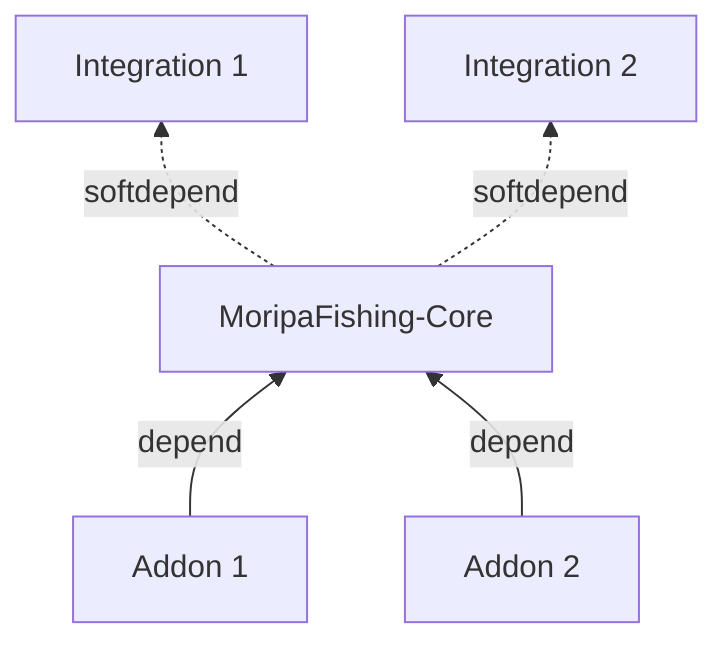

# はじめに

このプラグインは、Minecraftサーバーで魚釣りを楽しむためのプラグインです。
主な機能として、ランダムな魚の釣り上げを提供します。

釣り大会などのイベント機能は、Addonとして提供されることを想定しています。

以下に記載する対応範囲は本プラグインで実装されるべき機能です。
しかし、アドオン側として対応すべきとしている機能については、実装を行うということではありません。

対応範囲

### 当プラグインで対応すべき部分

#### 基本機能
- ワールドの管理
- 天候の管理
- 魚釣りの基本システム

#### 魚関連
- 魚のサイズなどの記録
- 魚の種類とレアリティの管理

#### システム関連
- 釣り上げまでの速度変化のインターフェース提供
- 釣果の統計データ収集

### アドオン側で対応すべき部分

#### イベント関連
- 特別な魚のイベント
- 釣り大会の開催

#### システム拡張
- 魚の売却
- スキルシステム
- 釣りスポットのランキング
- 釣りスポットの設定
- 釣り関連の実績
- 釣り竿のカスタマイズ
- 釣り竿の強化システム
- 釣り上げまでの時間調整
- 魚釣りクエスト

MoripaFishing は **Core / Integration / Addon** の 3 層で構成されます。

- **Core**: 魚抽選・釣りイベントなどの最小機能を提供する本体プラグイン
- **Integration**: Core が `softdepend` で参照する外部プラグイン。導入時に機能が有効になる（例: ワールド境界同期、カスタムジェネレーター）
- **Addon**: Core に `depend` して Core の API を使い拡張する外部プラグイン

詳細は [Integration とは](../integration/overview) を参照してください。

## サポート

このプラグインは、Minecraft 1.21.4 以降をサポートしています。

## 注意

:::warning[注意]
現在MoripaFishingは開発中のため、
バージョンアップ等によって破壊的な仕様変更が行われる可能性があります。
:::
