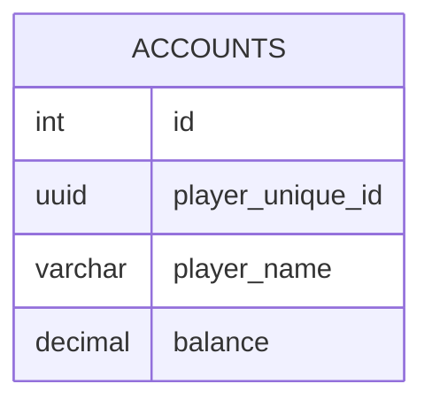

import { AccountsTable, FishingLogsTable } from '@/components/tables';

# データベース

MoripaFishingはSQLiteとPostgreSQLをサポートしています。

## テーブル定義

<AccountsTable />

<FishingLogsTable />

## ER図

```mermaid
erDiagram

    ACCOUNTS {
        int id
        uuid player_unique_id
        varchar player_name
        decimal balance
    }

```
