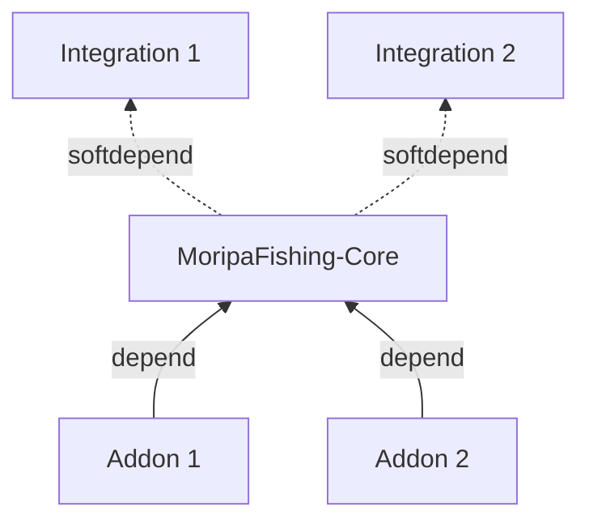

# Integration とは

MoripaFishing は **Integration** と **Addon** の 2 種類の外部プラグインと連携します。
依存の向きが逆になるため、役割も異なります。

| 区分 | 依存関係 | 代表例 | 特徴 |
|---|---|---|---|
| **Core** | — | `MoripaFishing` 本体 | 魚抽選・釣りイベント・天候判定などの最小機能 |
| **Integration** | Core が Integration を参照 | `MoripaFishingWorldLifecycle` | Core が SPI 経由で機能の実体を借りる。未導入時は該当機能が無効 |
| **Addon** | Addon が Core に依存 | 釣果アナウンス、参加時テレポートなど | Core の API を利用して拡張する外部プラグイン |



## Integration の仕組み

Integration は独立した Bukkit プラグイン jar として提供され、
以下のように Core から検出・利用されます。

1. Integration の `JavaPlugin` が `party.morino.moripafishing.api` に
   定義された SPI インターフェース（例: `WorldLifecycleProvider`）を実装する。
2. Integration の `plugin.yml` には MoripaFishing への `depend` / `softdepend` を
   **書かない**。単独でロードされる独立したプラグインとして振る舞う。
3. Core の `plugin.yml` には Integration を `softdepend` として宣言し、
   ロード順を「Integration → Core」に揃える。
4. Core の `onEnable` で `Bukkit.getPluginManager().getPlugin("<Integration 名>")`
   を取得し、SPI 型にキャストできれば採用する。
5. Integration 未導入時は Core が `null` を保持し、該当機能はスキップされる。

:::info
Addon との違いは **「誰が誰を登録するか」** です。
Addon は Core に依存して `MoripaFishingAPI.registerXxx(...)` で自分を登録するのに対し、
Integration は Core が能動的に検出して取り込みます。
:::

## 利用側の確認方法

Integration が導入されているかは Core API から確認できます。

```kotlin
val api = Bukkit.getPluginManager().getPlugin("MoripaFishing") as MoripaFishingAPI
val worldLifecycle = api.getWorldLifecycleProvider()
if (worldLifecycle == null) {
    logger.warning("WorldLifecycle Integration が未導入です")
}
```

## 提供される Integration

現時点で公式に提供されている Integration は以下です。

- [`MoripaFishingWorldLifecycle`](./world-lifecycle): ワールド境界の同期・カスタムジェネレーターでのワールド作成
