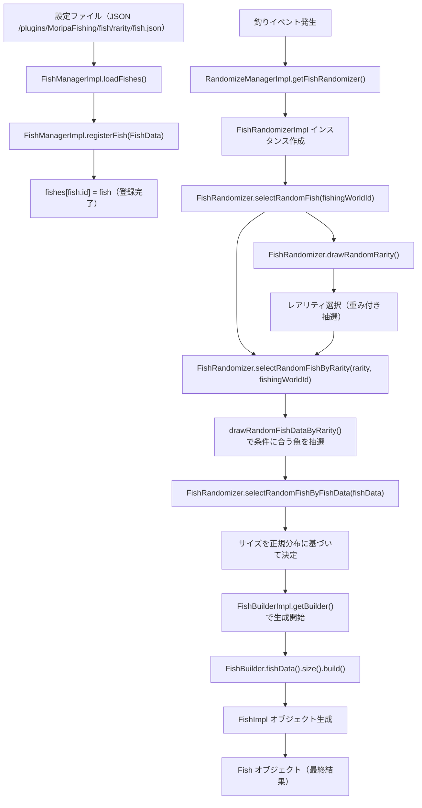

# 🐟 FishManagerについて

[Dokka APIリファレンス](https://fishing.plugin.morino.party/dokka/api/party.morino.moripafishing.api.core.fish/-fish-manager/index.html)

FishManagerは、魚のデータを管理するクラスです。

---

## 📝 Fishの登録からrandomizer経由で生成されるまでの流れ

MoripaFishingプラグインにおける、Fishの登録からrandomizer経由で生成されるまでの流れを、以下のMermaid図で説明します。

---

## 🔍 詳細な流れの説明

### 1️⃣ 魚の登録プロセス

- 設定ファイル（JSON）から魚のデータを読み込みます。
- `FishManagerImpl.registerFish()`メソッドで魚を登録します。
- 登録された魚は`fishes`マップに保存されます。

### 2️⃣ Randomizerの取得

- `RandomizeManagerImpl.getFishRandomizer()`メソッドから`FishRandomizer`のインスタンスを取得します。

### 3️⃣ 魚の抽選プロセス

- `FishRandomizer.selectRandomFish(fishingWorldId)`で魚の抽選を開始します。
- まず`drawRandomRarity()`メソッドでレアリティを抽選します。
- 抽選されたレアリティに基づいて`selectRandomFishByRarity()`が呼び出されます。
- `drawRandomFishDataByRarity()`で条件（天気、ワールド）に合う魚が抽選されます。

### 4️⃣ 魚オブジェクトの生成

- `selectRandomFishByFishData()`で魚のサイズが正規分布に基づいて決定されます。
- `FishBuilderImpl.getBuilder()`から`FishBuilder`を取得し、魚オブジェクトの生成を開始します。
- ビルダーパターンを使用して`fishData()`と`size()`で情報を設定し、`build()`メソッドで`Fish`オブジェクトを生成します。
- 最終的に`FishImpl`クラスのインスタンスが`Fish`オブジェクトとして返されます。

---

## 💡 Notes

- 魚のランダム化プロセスでは、まずレアリティが抽選され、次に魚種が抽選されます。これは重み付き抽選で、各レアリティと魚の`weight`プロパティに基づいています。
- 魚のサイズは正規分布に基づいて決定され、`min`と`max`の間の値が生成されます。
- 釣り場（`fishingWorldId`）や天気条件によって釣れる魚が異なります。
