# 🏗️ アーキテクチャ概要

MoripaFishingプラグインは階層化されたアーキテクチャで設計されており、各レイヤーが明確な責任を持っています。

## 📋 主要コンポーネント

### 🎯 コアシステム
釣りシステムの中核となる機能群です。

- **FishManager** - 魚データの管理と抽選
- **FishingManager** - 釣り全体の制御
- **WaitTimeManager** - 待ち時間の計算

### 📦 データモデル
システム全体で利用される主要なデータ構造です。

- **CaughtFish** - 釣果データ
- **FishData** - 魚種定義
- **RarityData** - レアリティ設定

## 🔄 処理フロー

```mermaid
graph TD
    A[プレイヤーが釣り開始] --> B[FishingManager]
    B --> C[WaitTimeManager]
    C --> D[待ち時間計算]
    D --> E[魚が食いつく]
    E --> F[FishManager]
    F --> G[魚抽選・生成]
    G --> H[CaughtFish作成]
```

