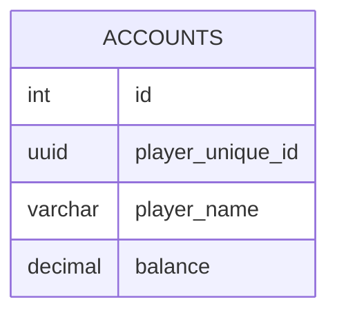

import { AccountsTable, FishingLogsTable } from '@site/src/components/tables';

# データベース

MoripaFishingはSQLiteとPostgreSQLをサポートしています。

## Table definition

<AccountsTable />

//TODO 何らかの影響でfish_idのdefinitionが消えた場合についても考慮
<FishingLogsTable />

## ER図

