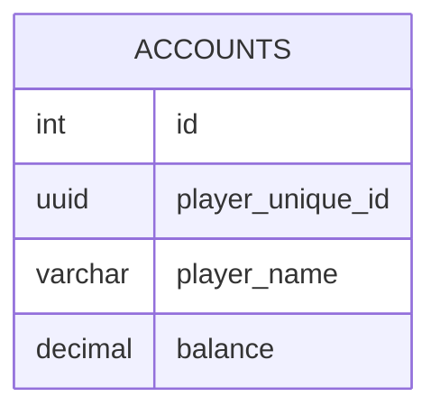

import { UUIDV7 } from '@site/src/components/uuid-example';
import { UUIDV4 } from '@site/src/components/uuid-example';
import { Timestamp } from '@site/src/components/timestamp';

# データベース

MoripaFishingはSQLiteとPostgreSQLをサポートしています。

## Table definition

### ACCOUNTS

<table>
    <thead>
        <tr>
            <th>column name</th>
            <th>type</th>
            <th>example</th>
            <th>description</th>
        </tr>
    </thead>
    <tbody>
        <tr>
            <td>id</td>
            <td>uuid v7</td>
            <td><UUIDV7 /></td>
            <td>主キー Kerria用のアカウントID</td>
        </tr>
        <tr>
            <td>minecraft_unique_id</td>
            <td>uuid v4   (varchar(36))</td>
            <td><UUIDV4 /></td>
            <td>Minecraft用のプレイヤーID</td>
        </tr>
        <tr>
            <td>player_name</td>
            <td>varchar(16)</td>
            <td>Notch | bank:Race</td>
            <td>プレイヤーの名前</td>
        </tr>
        <tr>
            <td>balance</td>
            <td>decimal(20, 4)</td>
            <td>1,000,000</td>
            <td>残高</td>
        </tr>
        <tr>
            <td>type</td>
            <td>enum</td>
            <td>player | bank</td>
            <td>アカウントの種類</td>
        </tr>
    </tbody>
</table>

## ER図

